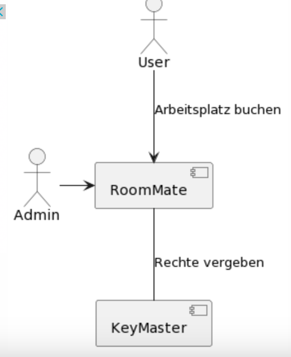

# RoomMate

Hier sollte ihr Projekt entstehen.

1. Einführung&Ziele:
- Was ist RoomMate? RoomMate ist ein Portal, über welches der Platzmangel an der Heinrich-Heine-Universität
geregelt werden soll. Ziel ist eine möglichst hohe Funktionalität der grundlegenden Funktionen(Buchen) und 
nicht möglichst viele Features einzubauen.
- Wesentliche Features: Buchen von Arbeitsplätzen(User), hinzufügen von Arbeitsplätzen(Admin), löschen von Arbeitsplätzen
und Buchungen(Admin), Bearbeiten/Hinzufügen von Arbeitsplätzen(Admin)
- Qualitätsziele: hohe Sicherheit der Admin Rollen, kein Ausfall des System länger als eine Stunde, Schutz der Kundendaten

2. Randbedingungen
- Technische Randbedingungen: moderate Hardwareausstattung, implementiert in java, betrieben auf Linux/MacOs 
Betriebssystemen
- Organisatorische Randbedingungen: Team: Yannis Wagner, Tobias Krüger
3. Kontextabgrenzung

- User: nutzt RoomMate um einen Arbeitsplatz zu buchen
- Admin: erstellt Arbeitsplätze und bearbeitet diese, kann Buchungen und Arbeitsplätze löschen

Technologie Stack
Java Version 21
Gradle 8.5
Spring Boot 3.1
Docker
PostgreSQL
OAuthApp in Github für die Anmeldung mit Github
Flyway für die Datenbankmigration
Thymeleaf, CSS Bootstrap, HTML

Ausführen des Projekts:
- die docker-compose.yaml starten
-Umgebungsvariablen setzen:
	-CLIENT_ID: 77bcc6136338178e1cad
	-CLIENT_SECRET: f4e0f58ed4a5bc08d78b7f700dd69a6cfec239cb
	-POSTGRES_PASSWORD: iamgroot
	-POSTGRES_USER: roommate

